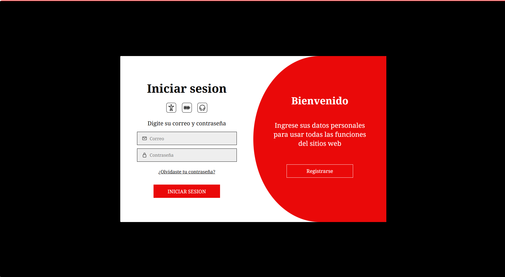
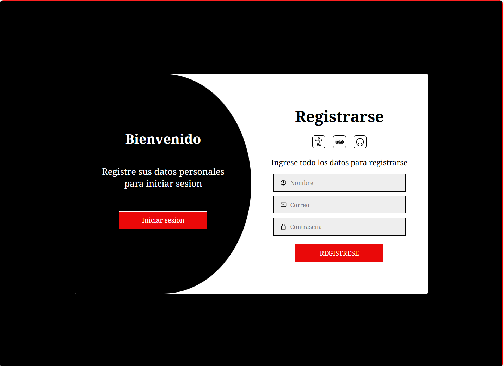

En este archivo puedes visualizar un estilo para la creacion de tu login y registro utilizando solo HTML,CSS PURO Y JAVAESCRIPT 

💻 En escritorio

INICIO DE SESION

REGISTRO 

🔐 Sistema de Autenticación - Interfaz Login/Registro
Este proyecto representa una interfaz de inicio de sesión y registro construida con HTML, CSS y JavaScript. Su objetivo es ofrecer una experiencia fluida, moderna y visualmente atractiva para usuarios que desean acceder o crear una cuenta. Está inspirado en prácticas reales de diseño responsivo y animaciones transicionales, ideal para una futura migración a React y Tailwind CSS.

🛠️ Tecnologías utilizadas
HTML5

CSS3 (con transiciones y transformaciones)

    /* añadiremos una trasnsicion a la propiedad transform para que se vea la animacion al cambiar de formulario */
    transition: transform 0.5s ease-in-out;

JavaScript ES6+