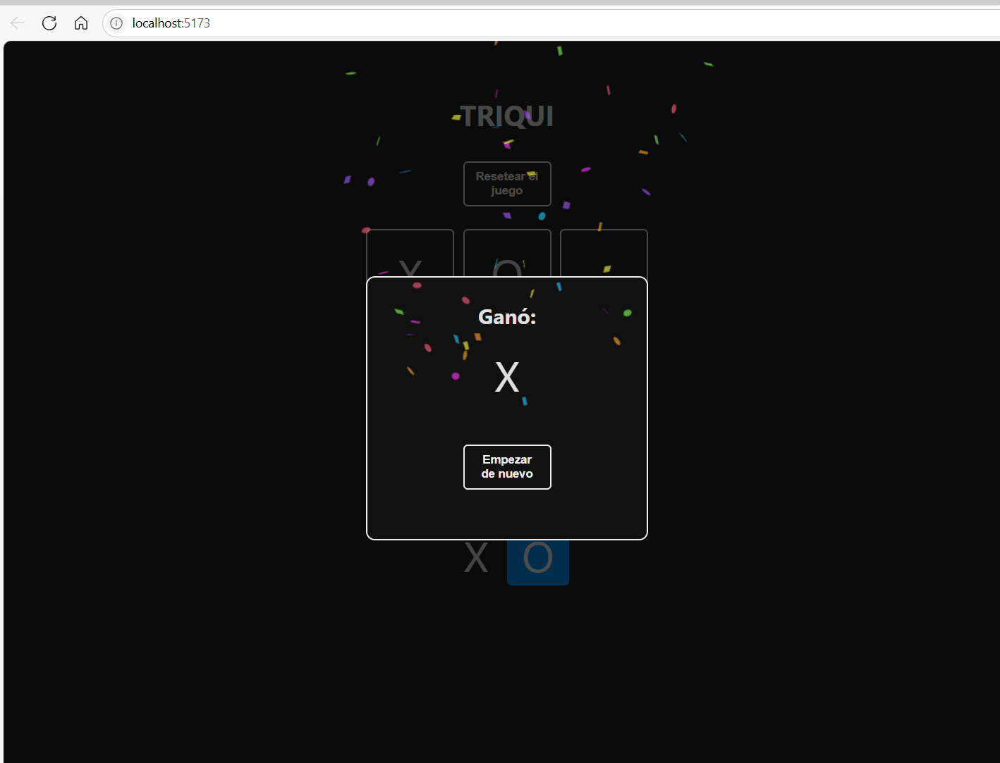
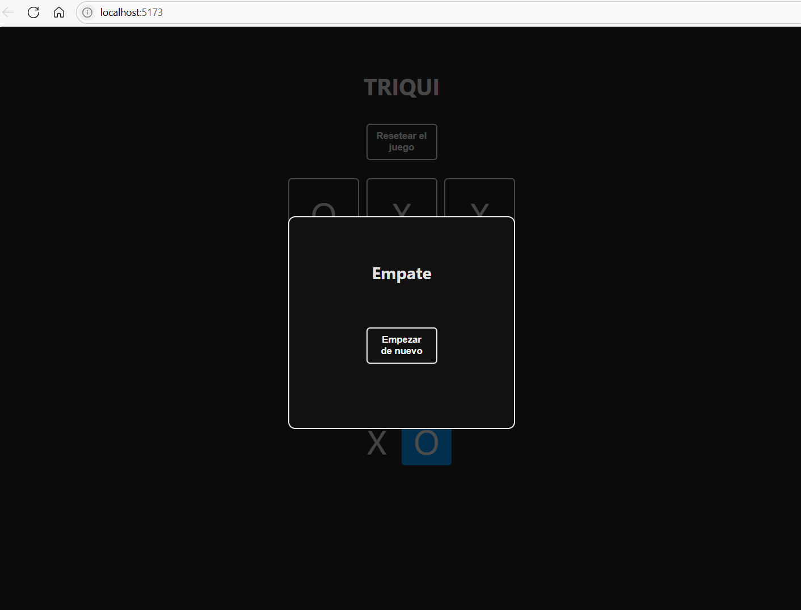

# React + Vite
🎮 Juego de Triqui (Tic-Tac-Toe)
Una versión interactiva y minimalista del clásico Triqui, desarrollada con React y Vite, enfocada en reforzar conceptos clave de estados y lógica condicional.

⚙️ Funcionalidades
Detección automática de victorias o empate.

Control de turnos entre jugadores X y O.

Reinicio de partida sin recargar.

Interfaz limpia y responsiva.

💥 Detalles Visuales
🎉 Celebración con confeti al detectar un ganador.

🤝 Mensaje de "Empate" en caso de tablero completo sin ganador.

🧠 Mensaje dinámico en pantalla: "Ganó: X" / "Ganó: O" con botón "Empezar de nuevo".

🛠️ Tecnologías
React
Vite
CSS - Tailwind.

- [@vitejs/plugin-react](https://github.com/vitejs/vite-plugin-react/blob/main/packages/plugin-react) uses [Babel](https://babeljs.io/) for Fast Refresh
- [@vitejs/plugin-react-swc](https://github.com/vitejs/vite-plugin-react/blob/main/packages/plugin-react-swc) uses [SWC](https://swc.rs/) for Fast Refresh

## Expanding the ESLint configuration

If you are developing a production application, we recommend using TypeScript with type-aware lint rules enabled. Check out the [TS template](https://github.com/vitejs/vite/tree/main/packages/create-vite/template-react-ts) for information on how to integrate TypeScript and [`typescript-eslint`](https://typescript-eslint.io) in your project.

